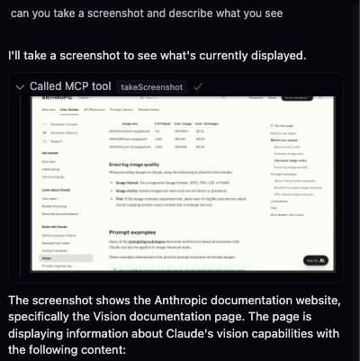

# webdev-mcp

An MCP server that provides useful web development tools.

## Usage

### Cursor

- To install in a project, add the MCP server to your `.cursor/mcp.json`:

```json
{
	"mcpServers": {
		"webdev": {
			"command": "npx",
			"args": ["webdev-mcp"],

		}
	}
}
```

- To install globally, add this command to your Cursor settings:

```bash
npx webdev-mcp
```

### Windsurf

- Add the MCP server to your `~/.codeium/windsurf/mcp_config.json` file:

```json
{
	"mcpServers": {
		"webdev": {
			"command": "npx",
			"args": ["webdev-mcp"]
		}
	}
}
```

## Tools

Currently, the only 2 tools are `takeScreenshot` and `listScreens`. Your agent can use the list screens tool to get the screen id of the screen it wants to screenshot.

The tool will return the screenshot as a base64 encoded string.



## Tips

Make sure YOLO mode is on and MCP tools protection is off in your Cursor settings for the best experience. You might have to allow Cursor to record your screen on MacOS.
